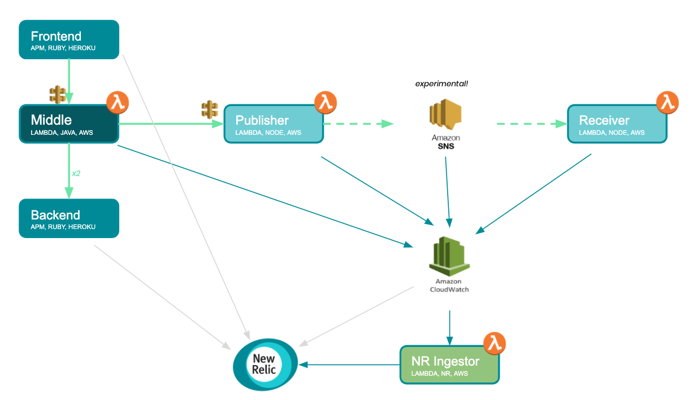

# Java/Node AWS Lambda & SNS Distributed Trace Instrumentation Example

The intention of the project is to demonstrate the following:

1. How to setup instrumentation of Java and Node AWS Lambda functions (including setup of the NR log ingestor)
2. To propogate distributed trace context across the Java lambda into backend services
3. Propogate distributed trace context across SNS (with nodejs)

### Demo Architecture

This project is composed of many parts. The demo application is composed of mutiple parts to demonstrate distributed tracing across mutliple technologies: 

1. A Front end, running in ruby hosted locally or on heroku
2. Java middle tier running in AWS lambda
3. A backend ruby app mimicking a hosted backend API (run on heroku)
4. Nodejs AWS lambda publisher application that publishes messages to SNS
5. Nodejs AWS lambda receiver application that is invoked by messages on SNS

## Setup
You can setup this example to just use Java or Node, though it is intended to be setup with all techs in play.

The frontend and backend Ruby apps should be hosted somewhere accessible, such as Heroku. These simpply mimic a start and end point for a request trace.

The java app can be connected to an API gateway so that it can be called remotely by the Frontend ruby app (or directly through a browser should you wish to omit that Ruby part). The Java app makes http requests out to the Ruby backend (again this can be removed but the Ruby apps help show the trace running from app, to lambda and back out to app). 

The java app also makes an HTTP call to the node 'publisher' app, via API gateway. The node app is instrumented also with New Relic by following the instructions for [serverless plugin](https://docs.newrelic.com/docs/serverless-function-monitoring/aws-lambda-monitoring/get-started/enable-new-relic-monitoring-aws-lambda#serverless-plugin). Its been extended to add the trace context to the SNS message attributes, with the 'receiver' node app extracting the context and accepting the payload as part of its operation.

The url's used for connecting the various apps will need to be adjusted for your own setup, these should be quite obivous in the code where.

